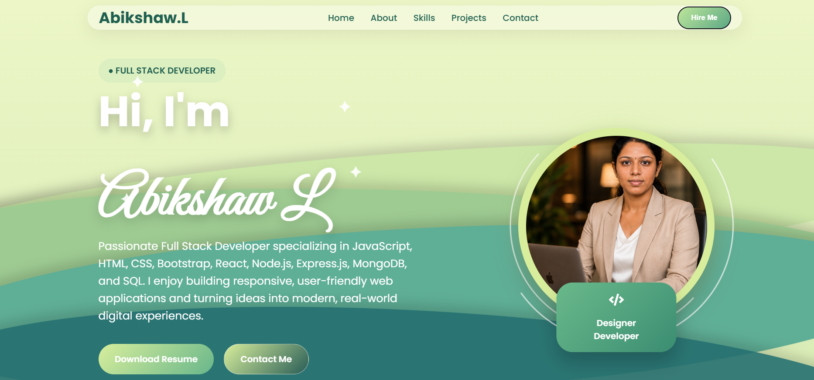
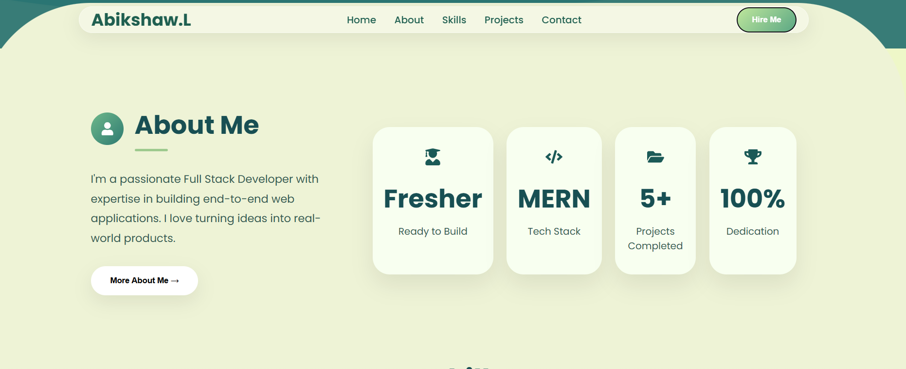
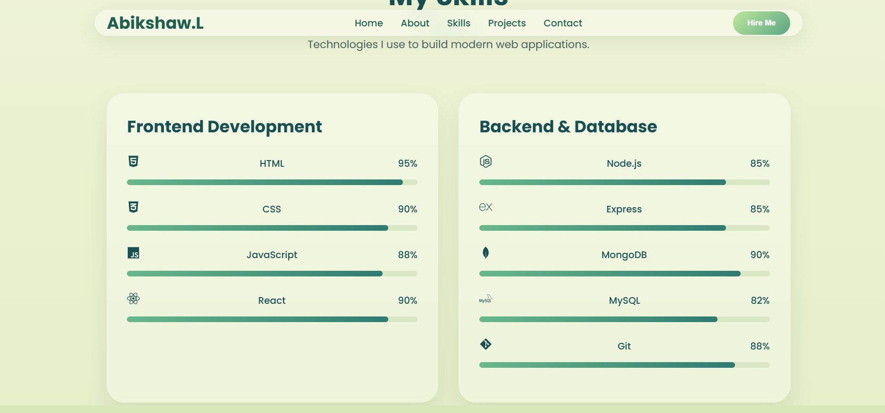
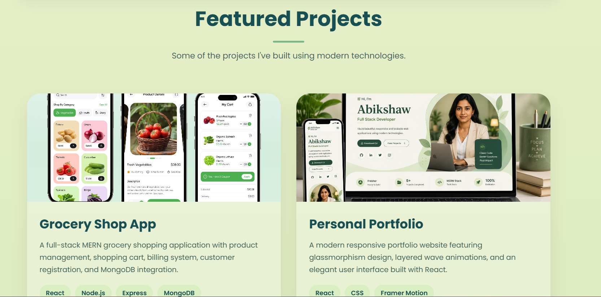
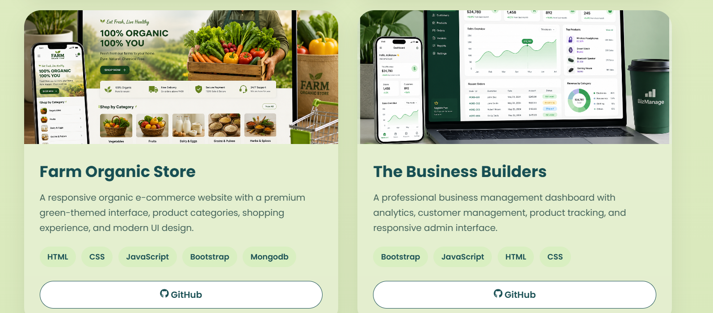
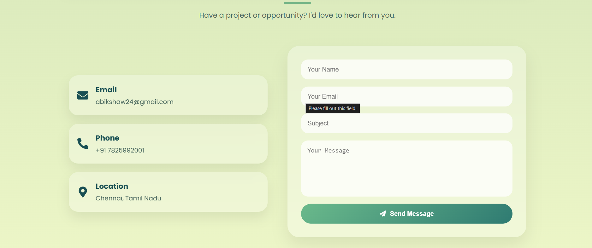
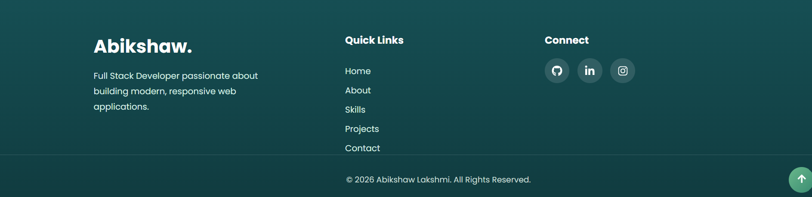

# 🌿 Personal Portfolio

A modern Full Stack Developer portfolio built with **React + Vite**, featuring smooth animations, layered wave backgrounds, glassmorphism-inspired UI, and a premium green-themed design.

> Designed and developed by **Abikshaw**.

---

## Live Preview

Portfolio built to showcase my projects, technical skills, and contact information.

---

## Hero Section

A clean landing page introducing my profile with animated layered waves and a responsive hero layout.

<p align="center"></p

---

## About Me

A responsive About section highlighting my background as a fresher, MERN stack expertise, and project achievements.

<p align="center"></p

---

## Technical Skills

Technologies I use to build modern web applications.

* HTML5
* CSS3
* JavaScript (ES6+)
* React.js
* Node.js
* Express.js
* MongoDB
* MySQL
* Git & GitHub

<p align="center"></p

---

## Featured Projects

A dedicated project showcase section with premium mockups.

<p align="center"></p>

### Included Projects

* Grocery Shop App (MERN)
* Personal Portfolio (React)
* Farm Organic Store
* Business Builders Dashboard

---

## Project Showcase Cards

Each project includes a description, technology badges, and GitHub links.

<p align="center"></p

---

## Contact Section

A responsive contact form with contact details and a modern card-based layout.

<p align="center"></p>

---

## Footer

Clean footer with quick navigation and social media links.

<p align="center"></p>
---

## Features

* Fully responsive design
* Premium green-themed UI
* Smooth animations with Framer Motion
* Modern card-based layouts
* Layered wave backgrounds
* Downloadable resume
* Contact form
* Social media integration

---

## Tech Stack

| Frontend | Libraries     | Tools   |
| -------- | ------------- | ------- |
| React    | Framer Motion | Git     |
| Vite     | React Icons   | GitHub  |
| CSS3     | Bootstrap     | Netlify |

---

## Project Structure

portfolio/
├── src/
│ ├── components/
│ ├── sections/
│ ├── assets/
│ └── styles/
├── public/
└── README.md

---

## Installation

```bash
git clone https://github.com/abikshaw24/your-portfolio-repo.git
cd your-portfolio-repo
npm install
npm run dev
```

---

## Deployment

Deployed using **Netlify**.

---


* GitHub: github.com/abikshaw24
* LinkedIn: linkedin.com/in/abikshaw-l-7a81612b4
* Email: [abikshaw24@gmail.com](mailto:abikshaw24@gmail.com)
